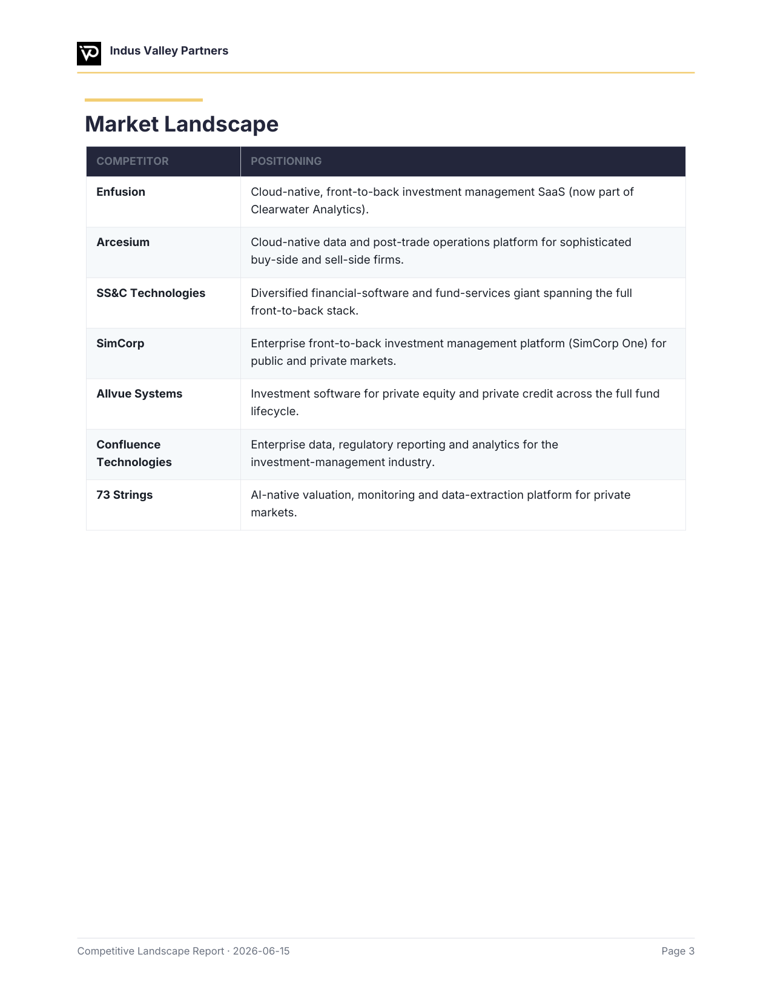

# MarketLens

**AI-driven, brand-aware competitor analysis — delivered as a branded PDF you can re-run to keep tabs on your market.**

MarketLens turns a single company URL into a polished competitive-landscape report, automatically styled in *that company's own branding* — its colors, fonts, and logo. Re-run it anytime: each run snapshots the market and the report highlights what changed since last time.


## Why it's different

- 🎨 **Brand-aware reports** — extracts each company's palette, logo, and **real fonts** (downloads the brand's Google Font as TTF; portable fallback otherwise). The report *structure* stays identical; only the skin changes per brand.
- 🔁 **Re-runnable monitoring** — durable per-run snapshots + an automatic **"what changed since last run"** diff.
- 🧭 **Multi-client** — analyze any number of companies, each isolated under `clients/<slug>/` (no collisions).
- 🆓 **Free & local** — research via built-in web search/fetch + plain `requests`; no paid scraping APIs required.
- 🧱 **WAT architecture** — **W**orkflows (markdown SOPs) + **A**gent (orchestration & reasoning) + **T**ools (deterministic Python). Probabilistic reasoning where it helps; deterministic code where it must be reliable.

## What's in the report

Branded cover → executive summary → your-business snapshot → market landscape (table + chart) → **marketing & channel presence** (incl. YouTube / LinkedIn) → per-competitor profiles (positioning, products, pricing, ratings, strengths/watch-outs, recent moves) → what's working for competitors → prioritized opportunities → what changed since last run → sources.



A full worked example for **Indus Valley Partners** ships in [`clients/ivp/`](clients/ivp/).

## Quickstart

Requires Python 3.11+ and [uv](https://github.com/astral-sh/uv).

```bash
uv venv && uv pip install -r requirements.txt

# 1. Scaffold a client (branding + real brand font + profile material) from one URL
uv run python tools/new_client.py https://acme.com --slug acme

# 2. Confirm branding + fill clients/acme/business_profile.json (from .tmp/acme_site.txt)
# 3. Research competitors -> .tmp/findings.json   (schema in workflows/competitor_analysis.md)

# 4. Build the branded PDF
uv run python tools/save_snapshot.py .tmp/findings.json --client acme
uv run python tools/diff_snapshots.py --client acme
uv run python tools/generate_report.py --client acme
#    -> clients/acme/reports/acme_<date>_competitor_report.pdf
```

Switch the active client anytime with `uv run python tools/use_client.py <slug>`.

## How it works (the agent loop)

MarketLens is designed to be driven by an AI coding agent (e.g. [Claude Code](https://claude.com/claude-code)) following the SOP in [`workflows/competitor_analysis.md`](workflows/competitor_analysis.md): the **agent** does discovery, web research, and synthesis; the **tools** do fetching, brand extraction, validation, change-tracking, and PDF rendering. Steps 2–3 above are the agent's reasoning; everything else is a deterministic command.

## Tools

| Tool | Role |
|---|---|
| `new_client.py` | One-command scaffold: branding + brand font + profile material + profile stub |
| `extract_brand.py` | Infer palette/logo + download the brand's real font → `brand_kit.json` |
| `brand_fonts.py` | Install a brand font (Google Fonts → TTF, else portable DejaVu) |
| `fetch_site.py` | Fetch + clean a web page (HTML, text, links, CSS, images, icons) |
| `save_snapshot.py` | Validate findings against the schema → a dated snapshot |
| `diff_snapshots.py` | Diff the two latest runs → "what changed" |
| `generate_report.py` | Render the branded PDF (reportlab) |
| `use_client.py` | List / switch the active client |

## Project layout

```
tools/                 # deterministic Python tools
workflows/             # markdown SOPs (the agent's instructions)
clients/<slug>/        # per-company: brand_kit, profile, brand assets, data/runs, reports
config.json            # the active client
CLAUDE.md              # WAT operating instructions for the agent
```

## License

MIT — see [LICENSE](LICENSE).
